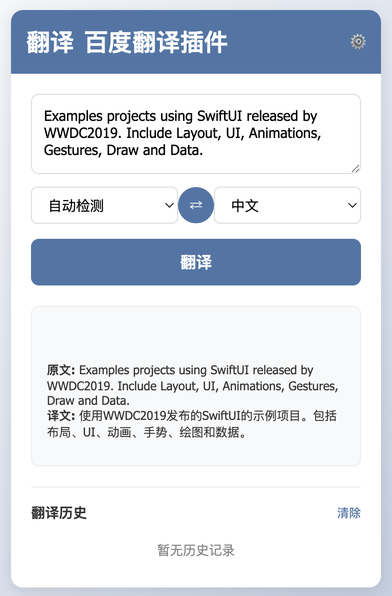
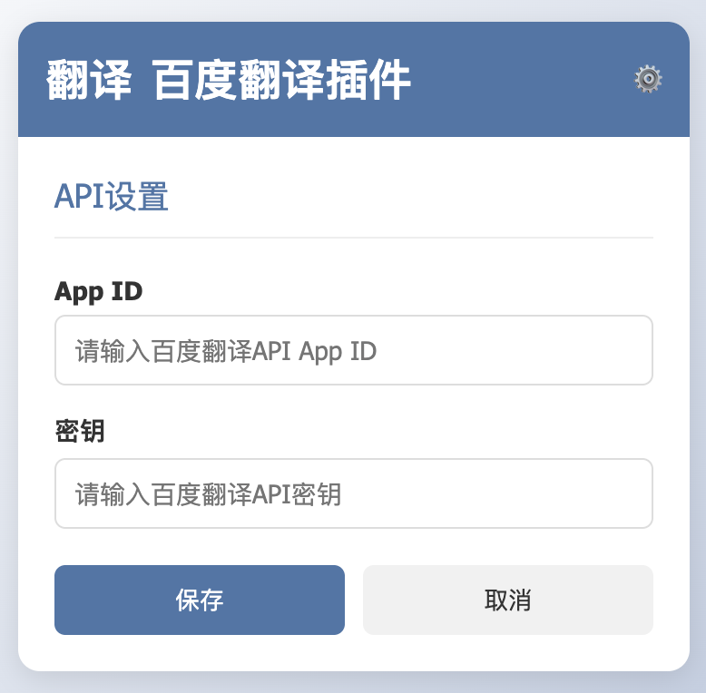
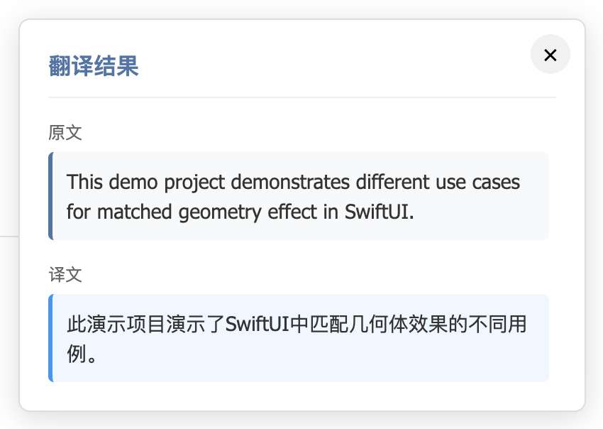

# 百度翻译浏览器插件


一个基于百度翻译API的Chrome浏览器翻译插件，支持右键快捷翻译和弹出窗口翻译。

## 预览




## 功能特性

- 🚀 **右键快捷翻译** - 选中文本后右键即可翻译
- 🎯 **多语言支持** - 支持中英日韩法德等多种语言互译
- ⚙️ **个性化设置** - 可配置百度翻译API参数
- 📚 **翻译历史** - 自动保存翻译记录，支持历史回顾
- 🎨 **优雅界面** - 现代化的弹窗设计，支持暗色主题
- 🔍 **实时预览** - 翻译结果实时显示，无需跳转页面

## 安装教程

### 方式一：Chrome应用商店安装（待发布）

即将上架Chrome应用商店...

### 方式二：手动安装

1. 下载或克隆本项目代码
2. 打开Chrome浏览器，进入扩展管理页面（`chrome://extensions/`）
3. 开启"开发者模式"
4. 点击"加载已解压的扩展程序"，选择项目文件夹
5. 扩展安装完成，开始使用

## 使用说明

### 基本使用

1. **右键翻译**：在网页中选中文本，右键选择"翻译到XX: '选中的文本'"
2. **弹出窗口**：点击浏览器工具栏中的插件图标，输入文本进行翻译
3. **语言切换**：在弹出窗口中可切换源语言和目标语言

### API配置

1. 点击插件图标打开弹出窗口
2. 点击右上角设置按钮(⚙️)
3. 输入您的百度翻译API AppID和密钥
4. 点击保存完成配置

> **注意**：使用前需要申请百度翻译API服务，访问[百度翻译开放平台](http://api.fanyi.baidu.com/)申请API密钥

## 项目结构

```
baidu-translate-extension/
├── manifest.json           # 扩展配置文件
├── background.js          # 后台服务脚本
├── content.js            # 内容脚本（页面注入）
├── md5.js               # MD5加密工具
├── icons/               # 扩展图标
│   ├── icon16.png
│   ├── icon48.png
│   └── icon128.png
├── popup/               # 弹出窗口界面
│   ├── popup.html
│   ├── popup.js
│   └── popup.css
├── _locales/            # 多语言支持
│   ├── en/
│   │   └── messages.json
│   └── zh_CN/
│       └── messages.json
├── README.md           # 项目说明文档
└── .gitignore         # Git忽略规则
```

## 开发指南

### 环境要求

- Chrome浏览器 88+（支持Manifest V3）
- 百度翻译API账号

### 开发命令

```bash
# 克隆项目
git clone <repository-url>

# 安装依赖（如有）
npm install  # 可选，当前项目无npm依赖

# 加载扩展
# 1. 打开 chrome://extensions/
# 2. 开启"开发者模式"
# 3. 点击"加载已解压的扩展程序"
# 4. 选择项目文件夹
```

### 构建说明

本项目为纯前端扩展，无需构建流程。直接加载源码即可使用。

## API参考

### 百度翻译API

插件使用百度翻译通用翻译API：
- API地址：`https://api.fanyi.baidu.com/api/trans/vip/translate`
- 请求方式：GET
- 参数说明：q、from、to、appid、salt、sign

### 扩展API

主要使用的Chrome扩展API：
- `chrome.contextMenus` - 右键菜单管理
- `chrome.storage` - 数据存储
- `chrome.runtime` - 运行时通信
- `chrome.tabs` - 标签页管理

## 常见问题

### Q: 为什么翻译失败？
A: 请检查：
1. 是否已配置正确的百度翻译API密钥
2. 网络连接是否正常
3. API调用额度是否充足

### Q: 右键菜单不显示？
A: 请检查：
1. 扩展是否已正确安装和启用
2. 是否在文本选择状态下右键

### Q: 如何清除翻译历史？
A: 在弹出窗口的历史记录部分点击"清除"按钮

## 更新日志

### v1.0.0 (2023-11-01)
- 初始版本发布
- 支持右键快捷翻译
- 支持多语言互译
- 支持翻译历史记录
- 支持API配置

## 相关项目

- [百度翻译开放平台](http://api.fanyi.baidu.com/)
- [Chrome扩展开发文档](https://developer.chrome.com/docs/extensions/)
- [Manifest V3迁移指南](https://developer.chrome.com/docs/extensions/mv3/intro/)

## 许可证

本项目采用 MIT 许可证 - 查看 [LICENSE](LICENSE) 文件了解详情

## 联系方式

- 提交Issue: [GitHub Issues](https://github.com/wumacms/baidu-translate-extension/issues)
- 邮箱: wumacms@foxmail.com

## 致谢

感谢以下开源项目：
- [百度翻译API](http://api.fanyi.baidu.com/)
- [Chrome Extension Samples](https://github.com/GoogleChrome/chrome-extensions-samples)
